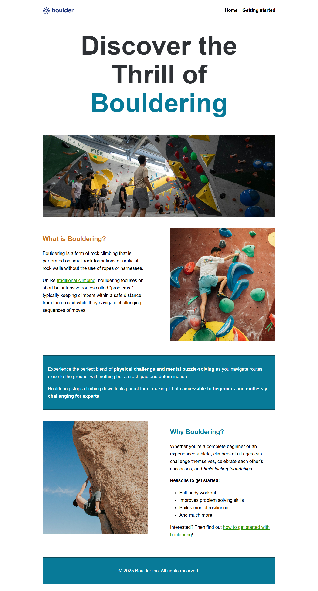
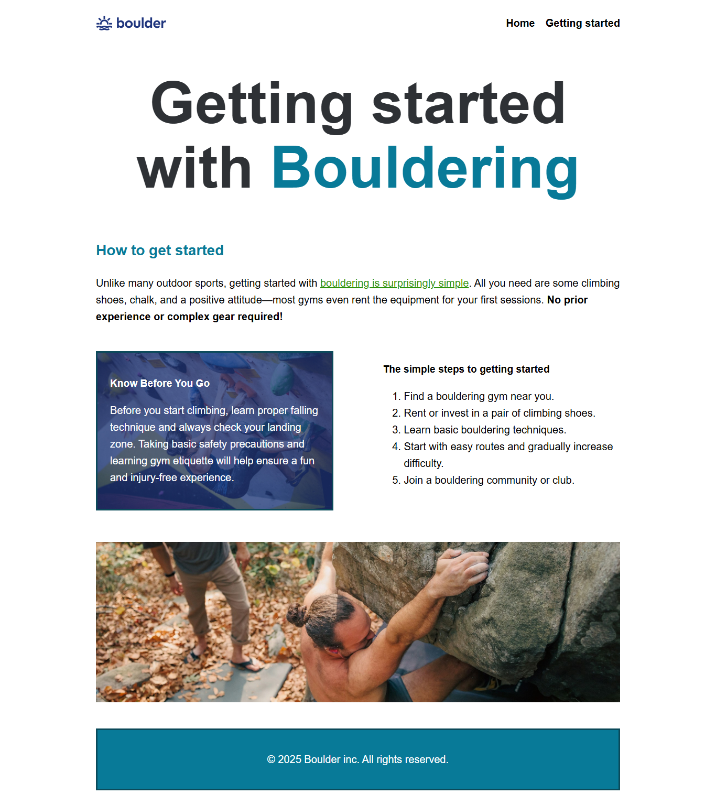
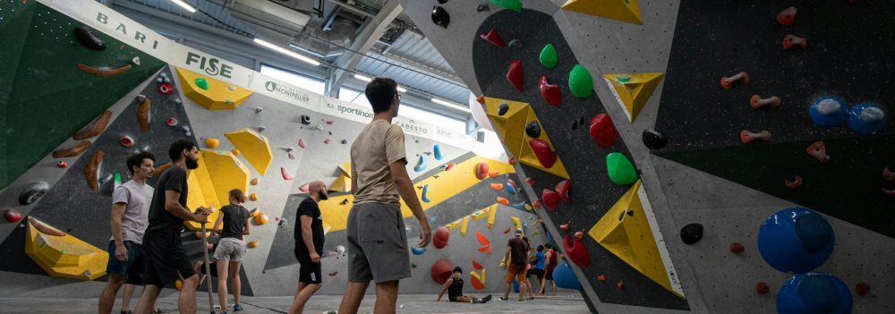

# Boulder Inc. - Bouldering Information Website

A modern, responsive two-page website dedicated to introducing people to the sport of bouldering. This project showcases clean HTML5 semantic markup, CSS Grid layouts, and responsive design principles.

## Table of Contents

- [Overview](#overview)
- [Features](#features)
- [Project Structure](#project-structure)
- [Technologies Used](#technologies-used)
- [Setup Instructions](#setup-instructions)
- [Page Breakdown](#page-breakdown)
- [CSS Architecture](#css-architecture)
- [Responsive Design](#responsive-design)
- [Accessibility](#accessibility)
- [Browser Compatibility](#browser-compatibility)
- [Future Enhancements](#future-enhancements)
- [Credits](#credits)

## Overview

Boulder Inc. is a static informational website designed to educate visitors about bouldering—a form of rock climbing performed without ropes or harnesses. The site features two main pages: a homepage introducing the sport and its benefits, and a "Getting Started" page providing practical steps for beginners.

### Live Demo

*(Add your live demo URL here if deployed)*

### Repository

GitHub: [https://github.com/greythedevv/-Bouldering-Information-Website.git](https://github.com/greythedevv/-Bouldering-Information-Website.git)

## Screenshots

### Homepage

*The homepage featuring the hero section, "What is Bouldering?" explanation, and "Why Bouldering?" benefits section*

### Getting Started Page

*The Getting Started page with step-by-step instructions and safety guidelines*

## Features

- **Responsive Design**: Fully responsive layout that adapts seamlessly from mobile to desktop devices
- **Modern CSS Grid Layout**: Utilizes CSS Grid for flexible two-column layouts
- **Semantic HTML5**: Properly structured markup for better SEO and accessibility
- **Clean Typography**: Readable font hierarchy with scalable text sizes
- **Interactive Navigation**: Hover effects and clear navigation structure
- **Image Optimization**: Responsive images that scale appropriately
- **Color-Coded Sections**: Distinctive teal color scheme for branding and visual hierarchy

## Project Structure

```
boulder-website/
│
├── index.html              # Homepage - Introduction to bouldering
├── index1.html             # Getting Started page
├── style.css               # Global stylesheet
│
└── images/                 # Image assets directory
    ├── logo.svg
    ├── bouldering-gym.jpg
    ├── what-is-bouldering.jpg
    ├── why-bouldering.jpg
    ├── getting-started-outdoors.jpg
    └── simple-steps.jpg
```

## Technologies Used

- **HTML5**: Semantic markup and accessibility features
- **CSS3**: Modern layout techniques including Grid and Flexbox
- **Responsive Design**: Media queries for mobile-first approach
- **No JavaScript**: Pure HTML/CSS implementation

## Setup Instructions

### Prerequisites

- A modern web browser (Chrome, Firefox, Safari, Edge)
- A code editor (VS Code, Sublime Text, etc.)
- Basic understanding of HTML and CSS

### Installation

1. **Clone or download the project**
   ```bash
   git clone https://github.com/greythedevv/-Bouldering-Information-Website.git
   cd -Bouldering-Information-Website
   ```

2. **Set up the directory structure**
   - Ensure `index.html`, `index1.html`, and `style.css` are in the root directory
   - Create an `images/` folder in the root directory
   - Place all image files in the `images/` folder

3. **Required Images**
   
   You'll need the following images in the `images/` directory:
   - `logo.svg` - Company logo
   - `bouldering-gym.jpg` - Indoor bouldering gym scene
   - `what-is-bouldering.jpg` - Person attempting a bouldering problem
   - `why-bouldering.jpg` - Outdoor boulder climbing scene
   - `getting-started-outdoors.jpg` - Outdoor climbing overhead angle
   - `simple-steps.jpg` - Background image for "Know Before You Go" section

4. **Launch the website**
   - Open `index.html` in your web browser
   - Or use a local development server:
     ```bash
     # Using Python 3
     python -m http.server 8000
     
     # Using Node.js with http-server
     npx http-server
     ```

## Page Breakdown

### Homepage (`index.html`)

**Purpose**: Introduce visitors to bouldering and explain why they should try it.

**Sections**:

1. **Header**
   - Company logo
   - Primary navigation menu (Home, Getting Started)

2. **Hero Section**
   - Large heading: "Discover the Thrill of Bouldering"
   - Hero image of an indoor bouldering gym

3. **What is Bouldering?**
   - Two-column layout (text + image)
   - Definition and explanation of bouldering
   - Comparison to traditional climbing
   - Highlighted callout box explaining the appeal

4. **Why Bouldering?**
   - Two-column layout (image + text)
   - Benefits list:
     - Full-body workout
     - Improves problem-solving skills
     - Builds mental resilience
   - Call-to-action link to Getting Started page

5. **Footer**
   - Copyright information

### Getting Started Page (`index1.html`)

**Purpose**: Provide practical steps for beginners to start bouldering.

**Sections**:

1. **Header**
   - Same navigation as homepage for consistency

2. **Page Title**
   - "Getting started with Bouldering"

3. **How to Get Started**
   - Introduction explaining simplicity of getting started
   - Equipment requirements

4. **Two-Column Information Section**
   - **Left Column**: "Know Before You Go" (with background image)
     - Safety tips
     - Etiquette guidelines
   - **Right Column**: "The Simple Steps to Getting Started"
     - Ordered list of 5 actionable steps

5. **Full-Width Image**
   - Outdoor climbing scene

6. **Footer**
   - Consistent with homepage

## CSS Architecture

### Global Styles

```css
* { box-sizing: border-box; }
```
- Applies border-box sizing to all elements for easier layout calculations

### Typography System

- **Body Text**: 1.25rem (20px) with 1.6 line-height for readability
- **H1**: 4.5rem mobile, 7rem desktop
- **H2**: 1.75rem
- **H3**: 1.2rem
- **Font Family**: System sans-serif stack for performance

### Color Palette

- **Primary Teal**: `#087a98` - Brand color for headings and accents
- **Dark Teal**: `#0b4a5a` - Borders and darker elements
- **Orange**: `#cb721c` - Secondary heading color
- **Green**: `#2b930b` - Link color
- **Dark Gray**: `#2e3135` - Main heading color
- **White**: `#ffffff` - Background and text on teal

### Layout Components

#### Wrapper
```css
.wrapper {
    max-inline-size: 1000px;
    margin-inline: auto;
    margin-block: 20px;
}
```
- Contains all content
- Maximum width of 1000px
- Centered horizontally with auto margins

#### Two-Column Layout
```css
.two-column-layout {
    display: grid;
    gap: 95px;
    margin-block-end: 60px;
    
    @media (width > 720px) {
        grid-template-columns: 1fr 1fr;
    }
}
```
- Single column on mobile
- Two equal columns on screens wider than 720px
- Large gap for breathing room

#### Navigation
```css
.primary-navigation ul {
    list-style: none;
    display: flex;
    gap: 20px;
}
```
- Horizontal flexbox layout
- No bullet points
- 20px spacing between items

### Utility Classes

- `.teal-bg`: Teal background with white text and border
- `.teal-text`: Applies teal color to text
- `.climber-bg`: Background image with overlay text styling

## Responsive Design

### Breakpoints

The website uses a mobile-first approach with a single main breakpoint:

- **Mobile**: Default styles (< 720px)
- **Desktop**: `@media (width > 720px)`

### Responsive Features

1. **Fluid Typography**
   - H1 scales from 4.5rem to 7rem
   - Body text remains consistent at 1.25rem

2. **Adaptive Layouts**
   - Two-column grids stack vertically on mobile
   - Navigation remains horizontal on all devices

3. **Flexible Images**
   - `max-inline-size: 100%` prevents overflow
   - `display: block` removes inline spacing issues

4. **Container Width**
   - Maximum width of 1000px prevents overly wide content on large screens
   - Auto margins center content

## Accessibility

### Semantic HTML

- Proper heading hierarchy (H1 → H2 → H3)
- Semantic tags: `<header>`, `<main>`, `<section>`, `<footer>`, `<nav>`
- Lists for navigation and enumerated content

### ARIA Labels

```html
<nav class="primary-navigation" aria-label="primary-navigation">
```
- Navigation labeled for screen readers

### Alt Text

All images include descriptive alt text:
```html

```

### Color Contrast

- Teal (#087a98) on white provides sufficient contrast
- White text on teal background meets WCAG AA standards

### Keyboard Navigation

- All links are keyboard accessible
- Hover states work with focus states

## Browser Compatibility

### Supported Browsers

- Chrome 88+
- Firefox 85+
- Safari 14+
- Edge 88+

### CSS Features Used

- **CSS Grid**: Widely supported in modern browsers
- **Flexbox**: Excellent browser support
- **Modern CSS Nesting**: `@media` queries use modern syntax
- **Logical Properties**: `margin-inline`, `max-inline-size` (newer syntax)

### Fallbacks

For older browsers, consider adding:
- Grid fallbacks using Flexbox
- Convert logical properties to physical (margin-inline → margin-left/right)

## Future Enhancements

### Planned Features

1. **JavaScript Interactivity**
   - Mobile hamburger menu
   - Image lightbox/gallery
   - Smooth scroll navigation
   - Form validation for contact/signup

2. **Additional Pages**
   - Gym finder/location page
   - Community/events page
   - Gear reviews and recommendations
   - Training tips and techniques

3. **Performance Optimization**
   - Image lazy loading
   - WebP format with fallbacks
   - CSS/HTML minification
   - Critical CSS inlining

4. **Enhanced Accessibility**
   - Skip to content link
   - Improved focus indicators
   - Screen reader testing and optimization

5. **SEO Improvements**
   - Meta descriptions
   - Open Graph tags
   - Structured data markup
   - Sitemap.xml

6. **Design Enhancements**
   - Dark mode toggle
   - Animation on scroll
   - Custom icon font
   - Enhanced micro-interactions

## Credits

### Design & Development

- Website Design: Boulder Inc.
- Development: Oluwole Greatness Adeola
- Copyright © 2025 Boulder Inc. All rights reserved.

### Resources

- Images: [Specify source - stock photos, original photography, etc.]
- Fonts: System default sans-serif
- Icons: SVG logo (custom/source)

## License

[Specify your license - MIT, Creative Commons, Proprietary, etc.]

## Contact

For questions, suggestions, or contributions:
- Email: oluwolegreatnessadeola@gmail.com
- GitHub: https://github.com/greythedevv/-Bouldering-Information-Website

---

**Last Updated**: January 2025  
**Version**: 1.0.0